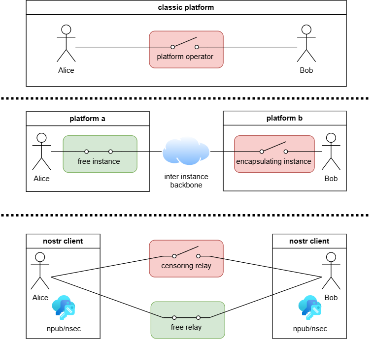

# Brezn

Brezn is like CB radio for the internet: local communication in your area, without central control. Brezn is a PWA client for the Nostr protocol and focuses on local networking using five-digit geohash (4.9 × 4.9 km cell).

## Installation

[Brezn](https://dabena.github.io/Brezn/) can be installed as a Progressive Web App (PWA) and then runs like a native app:

- **Android**: Banner "Add to Home Screen" or Menu → "Add to Home Screen"
- **iOS**: ⚠️ PWAs may have limited functionality in Safari. For better PWA support, install a browser that fully supports PWAs, e.g. [Firefox](https://apps.apple.com/app/firefox-private-safe-browser/id989804926). On older iOS versions, use the Share button 📤 → "Add to Home Screen"

After installation, Brezn appears with the Brezn icon on the home screen/start menu and opens as a standalone app without browser UI.

## What is Nostr?

"Notes and Other Stuff Transmitted by Relays" is an open protocol for social networks. Many independent relays store and distribute messages (Nostr events). Different Nostr apps speak the same protocol and can access the same content. Your identity consists of a key pair (npub/nsec) and is not bound to a server – you can sign in to different clients and keep the same account and posts everywhere. If a relay is blocked or goes offline, users can switch to others without losing their identity or posts.

## Network Architectures Compared



- **Classic social networks**: All users via a central server. The platform can censor content and exclude users.
- **Federated networks** (e.g. email, mastodon): Users on different instances that communicate via an instance backbone. Each instance can enforce its own rules and block other instances.
- **Nostr**: Users connect to multiple relays simultaneously. Relays do **not** communicate directly with each other, communication runs through clients. For censorship to occur, **all shared relays** would need to cooperate. As long as just one shared relay doesn't cooperate, no censorship happens.

## What does Brezn do exactly?

Brezn is just one view of Nostr and not its own social network. The app loads, displays, and sends Nostr events that are stored on relays. With the same relays and keys, you see the same content in other Nostr clients (e.g., Amethyst, Damus, Coracle), just in a different interface.

## Tech Stack

- `React` + `Vite`
- `Tailwind CSS`
- `nostr-tools`
- PWA: `vite-plugin-pwa` (Service Worker + Offline Fallback)

## Development

```bash
npm install
npm run dev        # Development Server
npm run build      # Build
npm run preview    # Preview Build
```

**GitHub Pages**: Automatic deployment on push to `main` via `.github/workflows/deploy-pages.yml`.

## Acknowledgments

Many thanks to the developers of the dependencies and operators of public Nostr relays who make all of this possible.

## Legal stuff

Brezn is a client application that connects to the Nostr network. The developer of Brezn does not operate any Nostr relays, host content, or process any personal data. All posts are sent directly to relays configured by the user. These relays store and distribute content according to their own policies. The developer has no control over content published on the Nostr network and no access to external relays. Brezn is provided "as is" without any warranties. The developer disclaims all liability for any damages arising from the use of the software or the Nostr protocol.

Brezn provides only optional client-side content filtering features for convenience, such as private keyword blocklist and user blocklists. When a report reason is provided by the user, Brezn sends a NIP-56 report event to relays. Relay operators may use this information to help maintain a healthy community, but they are under no obligation to act on reports. Relay operators are volunteers who provide a valuable service free of charge to the Nostr ecosystem and users should be respectful when contacting them.

Users are responsible for managing their private keys and the content they publish. Published content may remain permanently on the network and cannot be guaranteed to be deleted. Regarding concerns about user content please contact the respective relay operators and, if necessary, law enforcement authorities directly.

  [Impressum](https://mein.online-impressum.de/dabena/)
