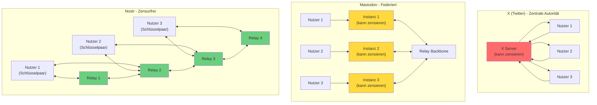

# Brezn

Live auf GitHub Pages: https://dabena.github.io/Brezn/

**Brezn** ist ein PWA Client für das offene und dezentrale **Nostr‑Protokoll**. Die App verbindet sich mit öffentlichen Relays und zeigt bzw. erstellt Nostr‑Events – sie ist damit nur eine von vielen möglichen Nostr‑Ansichten. Im Unterschied zu vielen anderen Nostr‑Clients, die auf globale Kommunikation ausgelegt sind, fokussiert sich Brezn auf lokale Vernetzung. Der Client nutzt dafür einen fünfstelligen Geohash, der eine 4,9 × 4,9 Kilometer große Zelle identifiziert.

## Was ist Nostr?

Nostr ist ein offenes Protokoll – vergleichbar mit E‑Mail, nur für soziale Netzwerke. Viele unabhängige Relays speichern und verteilen Nachrichten (Nostr‑Events). Verschiedene Nostr‑Apps (Clients) sprechen alle dasselbe Protokoll und können dadurch auf dieselben Inhalte zugreifen. Deine Identität besteht aus einem Schlüsselpaar (npub/nsec); mit diesen Schlüsseln kannst du dich in unterschiedlichen Nostr‑Clients anmelden und behältst überall denselben Account und dieselben Posts.

Nostr ist **zensurresistent**, weil es keine zentrale Instanz gibt, die Inhalte kontrollieren kann. Das Netzwerk besteht aus vielen unabhängigen Relays weltweit. Wenn ein Relay blockiert oder offline geht, können Nutzer zu anderen Relays wechseln, ohne ihre Identität oder Posts zu verlieren. Da deine Identität durch dein Schlüsselpaar definiert ist und nicht an einen Server gebunden, kann dich niemand dauerhaft ausschließen.

## Netzwerkarchitekturen im Vergleich

Das folgende Diagramm zeigt die Unterschiede zwischen zentralen, federierten und dezentralen Netzwerken:



**Erklärung:**

- **X (Twitter)**: Alle Nutzer sind über einen zentralen Server verbunden. Die Plattform kann Inhalte zensieren und Nutzer ausschließen.
- **Mastodon**: Nutzer sind auf verschiedenen Instanzen verteilt, die über ein Relay-Backbone kommunizieren. Jede Instanz kann ihre eigenen Regeln durchsetzen und zensieren (federierte Zensur).
- **Nostr**: Nutzer verbinden sich mit mehreren Relays gleichzeitig. Ihre Identität ist durch ein Schlüsselpaar definiert und nicht an einen Server gebunden. Keine zentrale Kontrolle möglich – zensurfrei.

## Was macht Brezn genau?

Brezn ist nur eine Ansicht auf Nostr und kein eigenes soziales Netzwerk. Die App lädt, zeigt und sendet Nostr‑Events, die auf Relays liegen. Wenn du andere Nostr‑Clients wie Amethyst, Damus oder Coracle verwendest und dort dieselben Relays sowie dieselben Schlüssel einstellst, siehst du in der Regel die gleichen Inhalte – nur in einer anderen Oberfläche.

## Rechtlicher Hinweis

Der Entwickler von Brezn betreibt keine Nostr‑Relays, hostet keine Inhalte und speichert keine Beiträge serverseitig. Posts werden an die vom Nutzer konfigurierten Relays gesendet, die Inhalte nach ihren eigenen Regeln speichern und verteilen. Der Entwickler hat keinen Einfluss auf Inhalte im Nostr‑Netzwerk und keinen Zugriff auf fremde Relays. Brezn stellt nur client‑seitige Moderation (Wörter Blockliste) bereit. Nutzer sind selbst verantwortlich für ihre Nutzung, Schlüssel und Inhalte.

## Tech-Stack

- React + Vite
- Tailwind CSS (Dark Mode only)
- `nostr-tools`
- PWA: `vite-plugin-pwa` (Service Worker + Offline-Fallback)

## Entwicklung

```bash
npm install
npm run dev        # Development Server
npm run build      # Build
npm run preview    # Preview Build
```

**GitHub Pages**: Automatisches Deploy bei Push auf `main` via `.github/workflows/deploy-pages.yml`.
