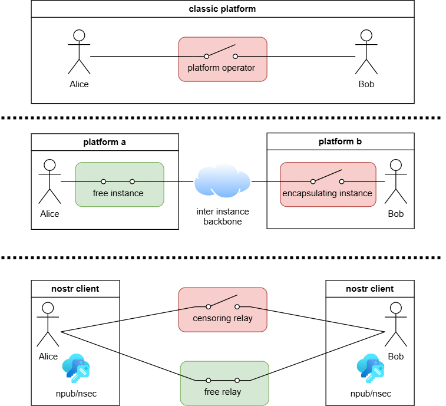

# Brezn

> **Try the [live browser demo](https://dabena.github.io/Brezn/)**

Brezn is a Nostr client that shows posts from your **local** area.
Your position is reduced to a five-character geohash (roughly 5 × 5 km cells, depending on latitude). Only the cell is shared, never your exact coordinates.  
Set your feed radius by adjusting geohash query length.  
Like CB radio for the internet: free, equal, and decentralized.

## Installation

[Brezn](https://dabena.github.io/Brezn/) can be installed as a Progressive Web App (PWA) and then runs like a native app:

- **Android**: Use the browser banner "Add to Home Screen" or go to Menu → "Add to Home Screen".  
  Alternatively, download the latest [APK](https://github.com/dabena/Brezn/releases/latest).
- **iOS**: Tap Share → "Add to Home Screen". PWAs may have limited support in Safari. For the best experience, use a browser with full PWA support such as [Firefox](https://apps.apple.com/app/firefox-private-safe-browser/id989804926).

After installation, Brezn appears with its own icon on your home screen and opens as a standalone app without browser.

## What is Nostr?

[Notes and Other Stuff Transmitted by Relays](https://fiatjaf.com/nostr.html) is an open, decentralized protocol for social networking.
Messages (events) are stored and distributed by many independent relays. Different Nostr apps speak the same protocol and can access the same content.
Your identity consists of a key pair (npub/nsec) and is not bound to a server or app. If a relay goes down, you simply use others without losing your identity or content.

## Network Architectures Compared



- **Classic social networks**: Everything runs through one centrally controlled company server.
- **Federated networks** (e.g. email, Mastodon): Multiple servers that talk to each other. Each server can enforce its own rules and block other servers.
- **Nostr**: Clients connect to multiple relays simultaneously. Relays do **not** talk to each other; communication runs through clients. If you publish to several relays, a single relay refusing an event does not stop you.

## What does Brezn do?

Brezn is a client for the existing Nostr protocol with focus on local, location-based feeds using geohash tags and **not** its own social network.
With the same keys and relays you can see the same content on other Nostr clients.

## Tech Stack

- `React` + `Vite`
- `Tailwind CSS`
- `nostr-tools`
- `vite-plugin-pwa`

## Development

Requires **Node.js 24+**

```bash
npm install
npm run dev        # Start development server
npm run build      # Production build
npm run preview    # Preview production build
npm run lint       # Run linter
npm run test       # Run tests
```

**GitHub Pages**: deployment on push to `main` via [`.github/workflows/deploy-pages.yml`](.github/workflows/deploy-pages.yml)

## Acknowledgments

Many thanks to the developers of the dependencies and operators of public Nostr relays who make all of this possible.

## Legal stuff

Brezn is a client application that connects to the Nostr network. The developer does not host published content, operate Nostr relays, or process any personal data.
When you post or send a DM, events go straight to the relays of your choice. Those relays store and distribute content according to their own policies.
Your keys and app settings are stored in your browser local storage on your device.
Build artifacts are hosted on GitHub Pages; access data is handled under GitHub’s [Privacy Statement](https://docs.github.com/en/site-policy/privacy-policies/github-privacy-statement).
Brezn is provided "as is" without warranties. The developer disclaims liability for damages arising from use of the software or the Nostr protocol.

Brezn offers optional client-side filtering (keyword mute, pubkey block). If you add a report reason when blocking, Brezn may send a NIP-56 report event to relays. Relay operators may use that information but are not obliged to act. Relay operators are volunteers who provide a valuable service free of charge to the Nostr ecosystem. Treat them with respect.

You are responsible for your private keys and what you publish. Content may remain on the network indefinitely and cannot be guaranteed deleted.

[Impressum](https://mein.online-impressum.de/dabena/)
