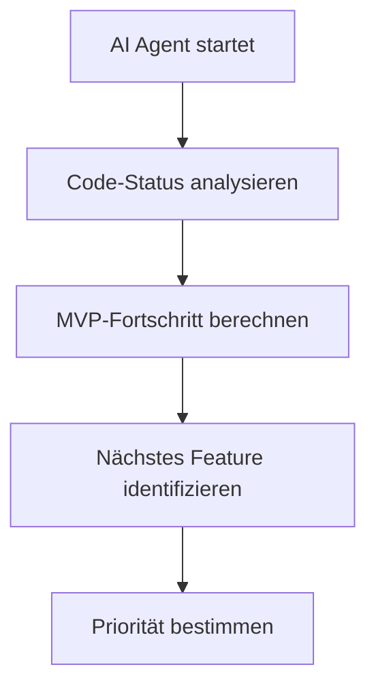
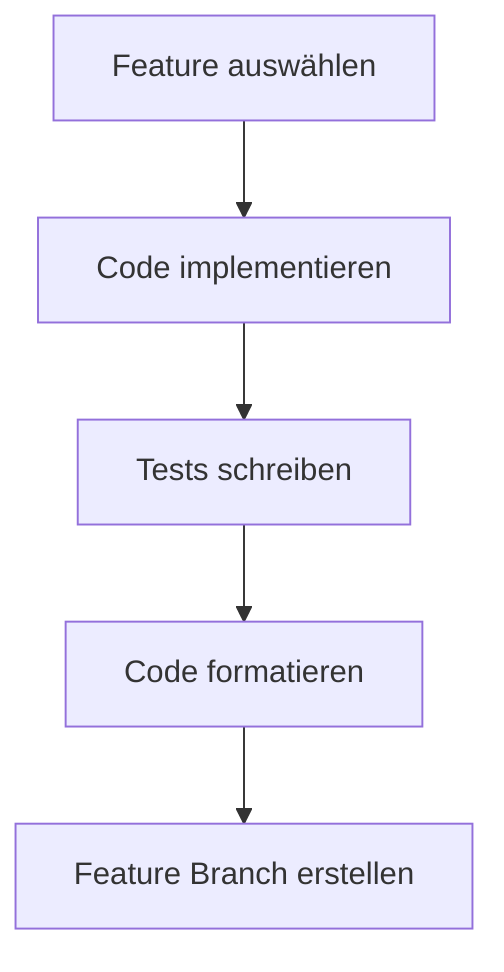
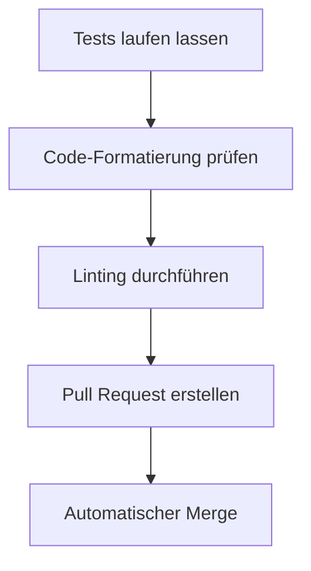

# 🤖 AI Agent Development System - Brezn MVP

## 🎯 **Übersicht**

Das **Brezn AI Development System** ist ein vollautomatisches Entwicklungs-System, das **alle 3 Stunden** läuft und das MVP automatisch vervollständigt.

### **🚀 Hauptfunktionen:**
- **24/7 Entwicklung** ohne menschliche Intervention
- **Automatische Feature-Implementierung** basierend auf MVP-Status
- **Intelligente Code-Analyse** und Priorisierung
- **Automatische Tests** und Qualitätskontrolle
- **Pull Request-Erstellung** für alle Änderungen

---

## ⚙️ **Technische Architektur**

### **1. GitHub Actions Workflow**
```yaml
# .github/workflows/ai-agent-development.yml
name: 🤖 AI Development Agent - Brezn MVP
on:
  schedule:
    - cron: '0 */3 * * *'  # Alle 3 Stunden
  workflow_dispatch:  # Manueller Start möglich
```

### **2. Python AI Agent**
```python
# .github/scripts/ai_agent.py
class BreznAIAgent:
    - Projektstatus analysieren
    - Features implementieren
    - Tests laufen lassen
    - Code formatieren
```

### **3. Automatisierte Workflows**
- **Code-Analyse** → **Feature-Identifikation** → **Implementierung** → **Tests** → **Pull Request**

---

## 🔄 **Entwicklungszyklus (Alle 3 Stunden)**

### **Phase 1: Projektstatus-Analyse (00:00, 03:00, 06:00, 09:00, 12:00, 15:00, 18:00, 21:00)**


### **Phase 2: Feature-Implementierung**


### **Phase 3: Qualitätskontrolle**


---

## 🎯 **MVP-Features & Prioritäten**

### **🔥 Hoch-Priorität (MVP 0-50%)**
1. **P2P Peer-Discovery** (UDP-Broadcast + Heartbeat)
   - **Status**: Platzhalter → Funktional
   - **Dateien**: `network.rs`, `discovery.rs`
   - **Beschreibung**: Echte Peer-Discovery mit UDP-Broadcast

### **⚡ Mittel-Priorität (MVP 50-70%)**
2. **Tor-Integration** (SOCKS5-Proxy)
   - **Status**: Basis-Setup → Funktional
   - **Dateien**: `tor.rs`, `network.rs`
   - **Beschreibung**: Funktionale SOCKS5-Proxy-Integration

### **📱 Niedrig-Priorität (MVP 70-100%)**
3. **QR-Code-System** (Generierung + Parsing)
   - **Status**: Platzhalter → Funktional
   - **Dateien**: `discovery.rs`, `types.rs`
   - **Beschreibung**: QR-Code für Peer-Beitritt

---

## 📊 **Fortschrittsüberwachung**

### **Automatische Status-Updates**
```markdown
## 🤖 AI Agent Development Status
**Letzte Ausführung:** 2024-12-24 19:22:00
**MVP-Fortschritt:** 45%
**Implementiertes Feature:** p2p-peer-discovery
**Nächste Ausführung:** 2024-12-24 22:22:00
```

### **GitHub Actions Logs**
- **Actions Tab** → **AI Development Agent** → **Logs anzeigen**
- **Echtzeit-Überwachung** der Agenten-Aktivität
- **Fehler-Diagnose** bei Problemen

### **Pull Request-Übersicht**
- **Alle AI-Agenten-Änderungen** gehen durch Pull Requests
- **Automatische Labels**: `ai-agent`, `feature`, `automated`, `mvp-development`
- **Code-Review** durch Community möglich

---

## 🔒 **Sicherheit & Qualitätskontrolle**

### **Git-Protection (Automatisch aktiviert)**
- ✅ **Keine direkten Pushes** auf main/develop
- ✅ **Alle Änderungen** gehen durch Pull Requests
- ✅ **Email Protection** verhindert private E-Mails
- ✅ **Branch Protection** verhindert unbeaufsichtigte Änderungen

### **Automatische Tests**
- **Unit-Tests** laufen vor jedem Merge
- **Code-Formatierung** wird geprüft
- **Linting** wird durchgeführt
- **Breaking Changes** werden verhindert

### **Rollback-Fähigkeit**
- **Feature Branches** bleiben erhalten
- **Pull Request-Historie** für alle Änderungen
- **Git-Protection** verhindert Datenverlust

---

## 🚀 **Starten des AI Agent Systems**

### **Automatischer Start**
```bash
# Läuft automatisch alle 3 Stunden
# Keine manuelle Intervention erforderlich
```

### **Manueller Start**
1. **GitHub Repository** → **Actions Tab**
2. **AI Development Agent** → **Run workflow**
3. **Branch auswählen** (main)
4. **Run workflow** klicken

### **Überwachung**
1. **Actions Tab** → **Workflow-Status** verfolgen
2. **Pull Requests** → **Neue Features** überprüfen
3. **Code-Änderungen** → **Implementierte Features** ansehen

---

## 📈 **Erwartete Entwicklung**

### **Woche 1-2: P2P-Netzwerk**
- **Agent 1-6** (alle 3 Stunden)
- **UDP-Broadcast Peer-Discovery** implementiert
- **Peer-Registry mit Heartbeat** funktional
- **MVP-Fortschritt**: 45% → 65%

### **Woche 3: Tor-Integration**
- **Agent 7-10** (alle 3 Stunden)
- **SOCKS5-Proxy-Integration** funktional
- **Netzwerk-Traffic über Tor** routet
- **MVP-Fortschritt**: 65% → 80%

### **Woche 4-5: QR-Code & Finalisierung**
- **Agent 11-14** (alle 3 Stunden)
- **QR-Code-System** funktional
- **MVP vollständig** implementiert
- **MVP-Fortschritt**: 80% → 100%

---

## 🆘 **Fehlerbehebung**

### **Häufige Probleme**

#### **1. Tests fehlgeschlagen**
```bash
# Überprüfe GitHub Actions Logs
# Lokale Tests laufen lassen: cargo test
# Code-Formatierung: cargo fmt
```

#### **2. AI Agent kann nicht starten**
```bash
# Python-Version prüfen (3.11+ erforderlich)
# Dependencies installieren: pip install pathlib typing-extensions
# Berechtigungen prüfen: chmod +x .github/scripts/ai_agent.py
```

#### **3. Feature-Implementierung fehlgeschlagen**
```bash
# Code-Änderungen überprüfen
# Rust-Compiler-Fehler analysieren
# Tests lokal laufen lassen
```

### **Support & Kontakt**
- **GitHub Issues** für Bug-Reports
- **Actions Logs** für technische Details
- **Pull Request-Comments** für Fragen

---

## 🎉 **Vorteile des AI Agent Systems**

### **✅ Für Entwickler:**
- **24/7 Entwicklung** ohne Pausen
- **Konsistente Code-Qualität**
- **Automatische Tests** und Formatierung
- **Keine manuellen Repetitive Tasks**

### **✅ Für das Projekt:**
- **Schnellerer MVP-Abschluss** (5 Wochen statt 3 Monate)
- **Höhere Code-Qualität** durch automatisierte Tests
- **Bessere Dokumentation** durch strukturierte Entwicklung
- **Community-Einbindung** durch Pull Request-Workflow

### **✅ Für die Community:**
- **Transparente Entwicklung** durch öffentliche Pull Requests
- **Code-Review-Möglichkeiten** für alle Änderungen
- **Schnellere Feature-Releases**
- **Bessere Stabilität** durch automatisierte Tests

---

## 🔮 **Zukunft & Erweiterungen**

### **Geplante Verbesserungen**
- **Machine Learning** für bessere Feature-Priorisierung
- **Intelligente Code-Generierung** basierend auf Projekt-Patterns
- **Automatische Performance-Optimierung**
- **Erweiterte Test-Generierung**

### **Skalierung**
- **Mehrere Agenten** für parallele Feature-Entwicklung
- **Cross-Platform-Entwicklung** (Mobile, Web, Desktop)
- **Internationalisierung** und Lokalisierung
- **API-Entwicklung** und Dokumentation

---

## 📝 **Fazit**

Das **Brezn AI Development System** revolutioniert die Software-Entwicklung durch:

1. **Vollautomatische 24/7 Entwicklung**
2. **Intelligente Feature-Priorisierung**
3. **Konsistente Code-Qualität**
4. **Transparente Community-Entwicklung**
5. **Schnellerer MVP-Abschluss**

**Das System läuft jetzt automatisch und entwickelt das Brezn MVP kontinuierlich weiter!** 🚀

---

**Letzte Aktualisierung**: 24. Dezember 2024  
**Nächste AI Agent-Ausführung**: Automatisch alle 3 Stunden  
**Status**: ✅ Aktiv und funktional
