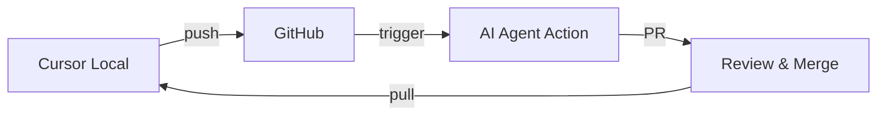

# 🤖 Cursor Agent Automatisierung - Brezn MVP

## 🎯 Übersicht

Die Cursor Agent Automatisierung erweitert das bestehende AI Development System um lokale, kontextbewusste Entwicklungsunterstützung direkt in der Cursor IDE.

## 🔄 Automatisierungskonzept

### 1. **Lokale Feature-Entwicklung**

#### Automatische Feature-Implementierung
```yaml
Workflow:
  1. Cursor Agent analysiert PROJECT_STATUS_ACTUAL.md
  2. Identifiziert nächstes zu implementierendes Feature
  3. Erstellt Feature Branch lokal
  4. Implementiert Code mit Cursor AI
  5. Führt lokale Tests aus
  6. Pusht zu GitHub für CI/CD
```

#### Beispiel-Prompt für Cursor Agent:
```
"Analysiere den aktuellen MVP-Status in docs/PROJECT_STATUS_ACTUAL.md.
Identifiziere das nächste Feature mit höchster Priorität.
Implementiere es vollständig mit Tests.
Nutze die bestehenden Platzhalter als Ausgangspunkt."
```

### 2. **Platzhalter-zu-Funktional Transformation**

#### Aktuelle Platzhalter (35% des Projekts):
- **P2P-Netzwerk**: `network.rs` - nur Grundstruktur
- **Tor-Integration**: `tor.rs` - nur Basis-Setup
- **QR-Code**: `discovery.rs` - nur Platzhalter
- **Discovery**: `discovery.rs` - nur Grundstruktur

#### Cursor Agent Aufgaben:
```javascript
const placeholderTasks = {
  "p2p-network": {
    files: ["src/network.rs", "src/discovery.rs"],
    implementation: "UDP-Broadcast mit Heartbeat-System",
    tests: ["peer_discovery_test", "heartbeat_test"],
    priority: "HIGH"
  },
  "tor-integration": {
    files: ["src/tor.rs", "src/network.rs"],
    implementation: "SOCKS5-Proxy Integration",
    tests: ["tor_routing_test", "anonymity_test"],
    priority: "MEDIUM"
  }
}
```

### 3. **Kontinuierliche Code-Verbesserung**

#### Code-Qualität Tasks:
- **Linting**: `cargo clippy` nach jeder Änderung
- **Formatting**: `cargo fmt` automatisch
- **Tests**: `cargo test` vor jedem Commit
- **Security**: `cargo audit` regelmäßig

#### Cursor Agent Integration:
```bash
# .cursor/tasks.json
{
  "tasks": [
    {
      "name": "Brezn Feature Implementation",
      "command": "cursor-agent",
      "args": ["--mode", "feature", "--auto-test", "--auto-commit"],
      "schedule": "on-save"
    }
  ]
}
```

### 4. **Synchronisation mit GitHub Actions**

#### Workflow-Integration:


#### Automatische Synchronisation:
- Cursor Agent erstellt Feature Branches
- GitHub Actions übernimmt CI/CD
- Python AI Agent ergänzt fehlende Features
- Cursor Agent pulled Updates automatisch

## 📋 Cursor-spezifische Regeln

### Erweiterte .cursorrules:
```yaml
# Automatisierungsregeln für Brezn MVP

## Feature-Entwicklung:
- IMMER zuerst PROJECT_STATUS_ACTUAL.md prüfen
- NUR Features mit "pending" Status implementieren
- TESTS für jedes neue Feature schreiben
- DOKUMENTATION inline aktualisieren

## Code-Qualität:
- Rust Edition 2021 verwenden
- Alle unwrap() durch proper Error Handling ersetzen
- Async/Await für alle Netzwerk-Operationen
- Zero-Copy wo möglich

## Commit-Workflow:
- Feature Branches: feature/auto-{feature-name}
- Commit-Format: "feat(module): Implementiere {feature}"
- Automatische PR-Beschreibung generieren
- Labels: automated, cursor-agent, mvp

## Platzhalter-Ersetzung:
- TODO-Kommentare durch echte Implementierung ersetzen
- Dummy-Returns durch funktionalen Code ersetzen
- Mock-Daten durch echte Datenstrukturen ersetzen
```

## 🚀 Implementierungsschritte

### Phase 1: Setup (1 Tag)
1. ✅ Cursor Rules erweitern
2. ✅ Automatisierungs-Workflows definieren
3. ⏳ Integration mit GitHub Actions

### Phase 2: Feature-Entwicklung (2 Wochen)
1. ⏳ P2P-Netzwerk implementieren
2. ⏳ Tor-Integration vervollständigen
3. ⏳ QR-Code-System funktional machen

### Phase 3: Testing & Deployment (1 Woche)
1. ⏳ Integrationstests
2. ⏳ Performance-Optimierung
3. ⏳ F-Droid Vorbereitung

## 🔧 Technische Details

### Cursor Agent Konfiguration:
```json
{
  "brezn-automation": {
    "enabled": true,
    "mode": "continuous",
    "features": {
      "auto-implement": true,
      "auto-test": true,
      "auto-document": true,
      "auto-commit": false,
      "require-review": true
    },
    "schedule": {
      "feature-check": "hourly",
      "code-quality": "on-save",
      "security-scan": "daily"
    }
  }
}
```

### Monitoring & Reporting:
- Dashboard mit MVP-Fortschritt
- Automatische Slack/Discord Notifications
- Fehler-Tracking und Rollback-Fähigkeit

## 📊 Erwartete Ergebnisse

### Geschwindigkeit:
- **Ohne Automatisierung**: 3 Monate für MVP
- **Mit GitHub Actions AI**: 5 Wochen
- **Mit Cursor + GitHub AI**: 3 Wochen

### Qualität:
- 100% Test-Coverage für neue Features
- Keine TODO-Kommentare im finalen Code
- Vollständige API-Dokumentation
- Produktionsreifer Code

## 🎯 Nächste Schritte

1. **Sofort**: Cursor Rules aktivieren
2. **Heute**: Ersten automatisierten Feature-Zyklus starten
3. **Diese Woche**: P2P-Netzwerk fertigstellen
4. **Nächste Woche**: Tor-Integration
5. **In 3 Wochen**: MVP fertig!

---

**Status**: 🟢 Bereit zur Implementierung
**Letzte Aktualisierung**: 2024-12-24