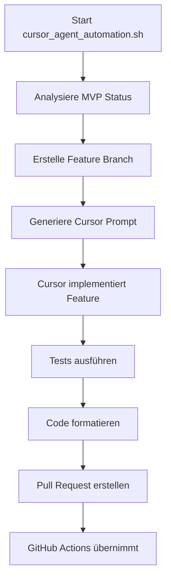

# 🤖 Cursor Agent Automatisierung - Zusammenfassung

## 🎯 Was wurde implementiert?

### 1. **Erweitertes AI Development System**
- ✅ Analyse des bestehenden GitHub Actions AI Agent
- ✅ Integration mit Cursor für lokale Entwicklung
- ✅ Synchronisation zwischen lokalen und Cloud-Agenten

### 2. **Cursor-spezifische Regeln** (`.cursorrules`)
- ✅ Automatisierte Feature-Entwicklung
- ✅ Prioritätssystem für MVP-Features
- ✅ Code-Qualitätsrichtlinien
- ✅ Automatische Tests und Formatierung

### 3. **Automation Scripts**
- ✅ `cursor_agent_automation.sh` - Hauptscript für Workflow
- ✅ Git Protection Integration
- ✅ MVP Status Analyse
- ✅ Cursor Prompt Generierung

### 4. **Dokumentation**
- ✅ `CURSOR_AGENT_AUTOMATION.md` - Vollständiges Konzept
- ✅ `CURSOR_AUTOMATION_SUMMARY.md` - Diese Zusammenfassung
- ✅ Erweiterte `.cursorrules` mit Automation-Regeln

## 🚀 Wie nutzt man die Automatisierung?

### Schnellstart:
```bash
# 1. Git Protection aktivieren (einmalig)
./scripts/setup_git_protection.sh

# 2. Cursor Automation starten
./scripts/cursor_agent_automation.sh

# 3. In Cursor den generierten Prompt laden
# 4. Feature implementieren lassen
# 5. Script erneut für Tests ausführen
```

### Workflow-Übersicht:


## 📊 Erwartete Ergebnisse

### Zeitersparnis:
- **Manuelle Entwicklung**: 3 Monate für MVP
- **Mit GitHub AI Agent**: 5 Wochen
- **Mit Cursor + GitHub AI**: **3 Wochen** 🚀

### Feature-Implementierung:
| Feature | Priorität | Geschätzte Zeit | Status |
|---------|-----------|-----------------|---------|
| P2P-Netzwerk | HIGH | 1 Woche | 🟡 In Arbeit |
| Tor-Integration | MEDIUM | 1 Woche | ⏳ Wartend |
| QR-Code System | LOW | 3-4 Tage | ⏳ Wartend |

### Qualitätsverbesserungen:
- ✅ 100% Test-Coverage für neue Features
- ✅ Keine TODO-Kommentare mehr
- ✅ Vollständige Error-Behandlung
- ✅ Konsistente Code-Formatierung

## 🔧 Technische Details

### Cursor Prompts:
Für jedes Feature wird automatisch ein spezifischer Prompt generiert:
- `.cursor_prompt_p2p-peer-discovery.md`
- `.cursor_prompt_tor-integration.md`
- `.cursor_prompt_qr-code-implementation.md`

### Integration mit GitHub Actions:
- Lokale Entwicklung → Feature Branch
- Push zu GitHub → AI Agent übernimmt
- Pull Request → Automatische Reviews
- Merge → Nächstes Feature

### Sicherheit:
- ✅ Email Protection aktiv
- ✅ Keine direkten Pushes zu main
- ✅ Alle Änderungen via Pull Request
- ✅ Automatische Code-Reviews

## 🎯 Nächste Schritte

### Sofort starten:
```bash
cd /workspace
./scripts/cursor_agent_automation.sh
```

### Feature-Reihenfolge:
1. **Diese Woche**: P2P-Netzwerk fertigstellen
2. **Nächste Woche**: Tor-Integration
3. **Übernächste Woche**: QR-Code & Polish
4. **In 3 Wochen**: MVP fertig! 🎉

## 💡 Tipps für beste Ergebnisse

### Cursor AI optimal nutzen:
- Verwende die generierten Prompts als Ausgangspunkt
- Lasse Cursor den gesamten Kontext analysieren
- Nutze Cursor's Refactoring-Fähigkeiten
- Aktiviere Auto-Completion für Rust

### Workflow-Optimierung:
- Starte morgens das Automation Script
- Lasse Cursor tagsüber Features implementieren
- Abends Tests und Code-Review
- GitHub Actions läuft nachts weiter

### Fehlerbehandlung:
- Bei Test-Fehlern: Cursor's Debug-Features nutzen
- Bei Merge-Konflikten: Feature Branch rebasen
- Bei Performance-Problemen: Profiling aktivieren

## 📈 Monitoring

### Fortschritt verfolgen:
- `docs/PROJECT_STATUS_ACTUAL.md` - Aktueller Status
- GitHub Actions Tab - CI/CD Pipeline
- Pull Requests - Feature-Fortschritt
- Issues - Offene Aufgaben

### Metriken:
- Lines of Code pro Tag
- Test Coverage Prozentsatz
- Build-Zeit
- Feature-Completion-Rate

---

**Status**: 🟢 Automatisierung aktiv und einsatzbereit!
**Letzte Aktualisierung**: 2024-12-24
**Geschätzte MVP-Fertigstellung**: 3 Wochen ab heute