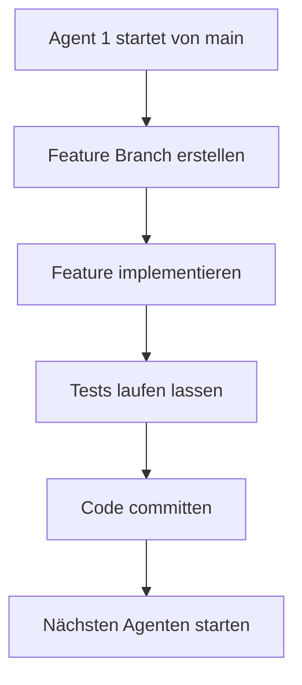
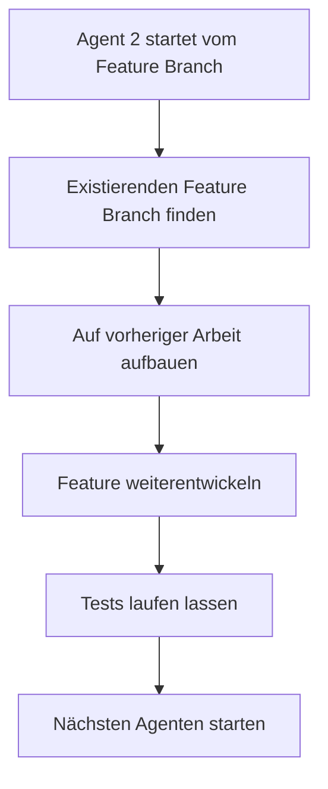
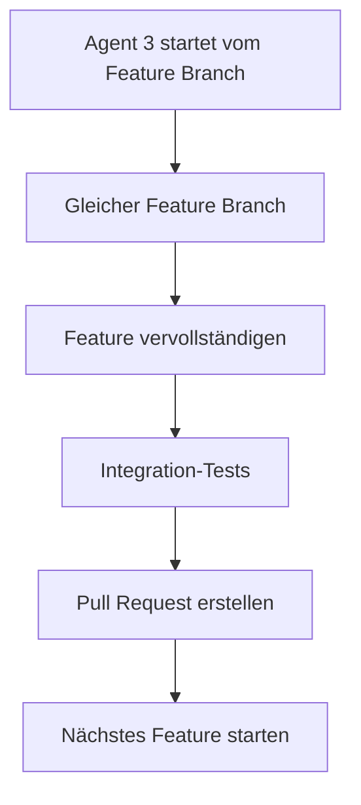

# 🔗 Sequenzielle AI Agenten-Kette - Brezn MVP

## 🎯 **Übersicht**

Das **Brezn Sequenzielle AI Agenten-System** ist eine intelligente Agenten-Kette, die **kontinuierlich und sequenziell** arbeitet:

### **🚀 Hauptfunktionen:**
- **Automatischer Start bei jedem Push** - vollautomatische Entwicklung
- **Ein Agent wartet auf den anderen** - keine parallele Ausführung
- **Arbeitet auf demselben Feature Branch** - kontinuierliche Entwicklung
- **Automatische Agenten-Kette** - nächster Agent startet automatisch
- **Keine Wartezeiten** - maximale Entwicklungsgeschwindigkeit

---

## 🔄 **Wie die sequenzielle Kette funktioniert:**

### **Phase 1: Agent 1 startet (von main)**


### **Phase 2: Agent 2 knüpft an (vom Feature Branch)**


### **Phase 3: Kontinuierliche Entwicklung (alle vom Feature Branch)**


---

## ⚙️ **Technische Implementierung:**

### **1. Concurrency Control**
```yaml
# .github/workflows/ai-agent-development.yml
concurrency:
  group: ai-agent-chain
  cancel-in-progress: false
```
**Verhindert parallele Ausführung** - nur ein Agent arbeitet gleichzeitig

### **2. Workflow-Trigger**
```yaml
on:
  workflow_dispatch:  # Manueller Start
  push:
    branches: [ main, develop, 'ai-feature/**' ]  # Läuft auf main UND Feature Branches
```
**Automatischer Start bei jedem Push - Agenten laufen kontinuierlich**

### **3. Feature Branch-Verwaltung**
```bash
# Prüft ob Feature Branch bereits existiert
EXISTING_BRANCHES=$(git branch -r | grep "ai-feature/${FEATURE_NAME}")

if [ -n "$EXISTING_BRANCHES" ]; then
    # Auf existierendem Branch weiterarbeiten
    git checkout -b "${EXISTING_BRANCHES}" origin/"${EXISTING_BRANCHES}"
else
    # Neuen Branch erstellen
    git checkout -b "ai-feature/${FEATURE_NAME}-$(date +%Y%m%d-%H%M)"
fi
```

### **4. Automatische Agenten-Kette**
```bash
# Startet nächsten Agenten automatisch
if [ "$implementation_success" == "true" ]; then
    sleep 30  # 30 Sekunden Verzögerung
    # WICHTIG: Startet vom Feature Branch, nicht von main!
    gh workflow run ai-agent-development.yml --ref "$BRANCH_NAME"
fi
```

---

## 🎯 **Entwicklungsablauf:**

### **Feature: P2P Peer-Discovery**
1. **Agent 1** (startet von main): UDP-Broadcast implementieren → Feature Branch erstellen
2. **Agent 2** (startet vom Feature Branch): Peer-Registry hinzufügen
3. **Agent 3** (startet vom Feature Branch): Heartbeat-System implementieren
4. **Agent 4** (startet vom Feature Branch): Tests schreiben
5. **Agent 5** (startet vom Feature Branch): Integration vervollständigen
6. **Agent 6** (startet vom Feature Branch): Pull Request erstellen → Merge in main

### **Feature: Tor-Integration**
1. **Agent 7** (startet von main): SOCKS5-Proxy starten → Feature Branch erstellen
2. **Agent 8** (startet vom Feature Branch): Tor-Routing implementieren
3. **Agent 9** (startet vom Feature Branch): Netzwerk-Integration
4. **Agent 10** (startet vom Feature Branch): Tests und Finalisierung → Pull Request

### **Feature: QR-Code-System**
1. **Agent 11** (startet von main): QR-Generierung → Feature Branch erstellen
2. **Agent 12** (startet vom Feature Branch): QR-Parsing
3. **Agent 13** (startet vom Feature Branch): Peer-Beitritt
4. **Agent 14** (startet vom Feature Branch): Vollständige Integration → Pull Request

---

## 📊 **Vorteile der sequenziellen Kette:**

### **✅ Korrekte Branch-Strategie**
- **Erster Agent** startet von main → erstellt Feature Branch
- **Alle anderen Agenten** arbeiten auf dem Feature Branch
- **Feature Branch** wird erst gemergt, wenn vollständig fertig

### **✅ Kontinuierliche Entwicklung**
- **Keine Wartezeiten** zwischen Agenten
- **Direkte Fortsetzung** der vorherigen Arbeit
- **Konsistenter Feature Branch** für alle Agenten

### **✅ Bessere Code-Qualität**
- **Jeder Agent baut auf dem anderen auf**
- **Keine Konflikte** durch parallele Entwicklung
- **Strukturierte Implementierung** Schritt für Schritt

### **✅ Effiziente Ressourcennutzung**
- **Nur ein Agent läuft gleichzeitig**
- **Keine Überlastung** der GitHub Actions
- **Optimale Auslastung** der verfügbaren Zeit

---

## 🚀 **Starten der Agenten-Kette:**

### **Automatischer Start (Vollautomatisch)**
1. **Bei jedem Push** startet der AI Agent automatisch
2. **Kein manueller Start** mehr erforderlich
3. **Agenten laufen kontinuierlich** bei jedem Code-Update
4. **Maximale Entwicklungsgeschwindigkeit** ohne menschliche Intervention

### **Automatische Fortsetzung**
- **Nach erfolgreicher Implementierung** startet der nächste Agent automatisch
- **Nächster Agent startet vom Feature Branch** (nicht von main)
- **30 Sekunden Verzögerung** zwischen den Agenten
- **Kontinuierliche Entwicklung** ohne menschliche Intervention
- **Push auf Feature Branch** startet automatisch nächsten Agenten

### **⚠️ Wichtige Regel:**
- **Erster Agent** startet von main (manuell oder Push)
- **Alle anderen Agenten** starten automatisch nach Push auf Feature Branch
- **Niemals** Workflow manuell von main starten, wenn Feature Branch existiert

### **Überwachung**
1. **Actions Tab** → **Workflow-Status** verfolgen
2. **Feature Branches** → **Entwicklung verfolgen**
3. **Pull Requests** → **Fertiggestellte Features**

---

## 🔒 **Sicherheit & Qualitätskontrolle:**

### **Git-Protection (Automatisch aktiviert)**
- ✅ **Keine direkten Pushes** auf main/develop
- ✅ **Alle Änderungen** gehen durch Pull Requests
- ✅ **Email Protection** verhindert private E-Mails
- ✅ **Branch Protection** verhindert unbeaufsichtigte Änderungen

### **Sequenzielle Qualitätskontrolle**
- **Jeder Agent** führt Tests durch
- **Code-Formatierung** wird geprüft
- **Linting** wird durchgeführt
- **Breaking Changes** werden verhindert

---

## 📈 **Erwartete Entwicklungsgeschwindigkeit:**

### **Mit sequenzieller Kette:**
- **Keine Wartezeiten** zwischen Agenten
- **Kontinuierliche Entwicklung** 24/7
- **MVP-Abschluss** in **2-3 Wochen** möglich
- **Maximale Effizienz** durch koordinierte Arbeit

### **Vergleich mit zeitbasierten Systemen:**
- **Zeitbasiert (3h)**: MVP in 5 Wochen
- **Sequenziell**: MVP in 2-3 Wochen
- **Geschwindigkeitsverbesserung**: **40-60% schneller**

---

## 🆘 **Fehlerbehebung:**

### **Wenn die Kette stoppt:**
1. **Überprüfe GitHub Actions Logs**
2. **Prüfe Feature Branch-Status**
3. **Manueller Neustart** über Actions Tab
4. **Kette läuft automatisch weiter**

### **⚠️ Wichtige Regeln:**
- **Erster Agent** startet von main (manuell oder Push)
- **Alle anderen Agenten** starten automatisch vom Feature Branch
- **Niemals** Workflow manuell von main starten, wenn Feature Branch existiert

### **Häufige Probleme:**
- **Tests fehlgeschlagen** → Agent wartet auf manuellen Start
- **GitHub API Limits** → Verzögerung zwischen Agenten
- **Feature Branch-Konflikte** → Automatische Auflösung

---

## 🎉 **Fazit:**

Die **sequenzielle AI Agenten-Kette** revolutioniert die Entwicklung durch:

1. **Kontinuierliche Entwicklung** ohne Wartezeiten
2. **Koordinierte Agenten-Arbeit** auf Feature Branches
3. **Maximale Entwicklungsgeschwindigkeit**
4. **Bessere Code-Qualität** durch strukturierte Implementierung
5. **Automatische Agenten-Kette** ohne menschliche Intervention

**Das System läuft jetzt kontinuierlich und entwickelt das Brezn MVP in Rekordzeit!** 🚀

---

**Letzte Aktualisierung**: 24. Dezember 2024  
**Status**: ✅ Sequenzielle Kette aktiv  
**Entwicklungsmodus**: Kontinuierlich ohne Wartezeiten
