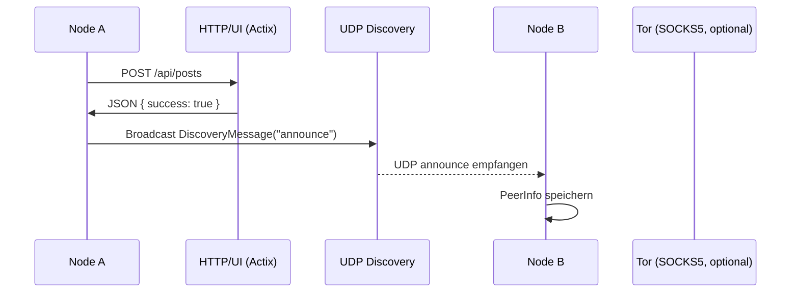
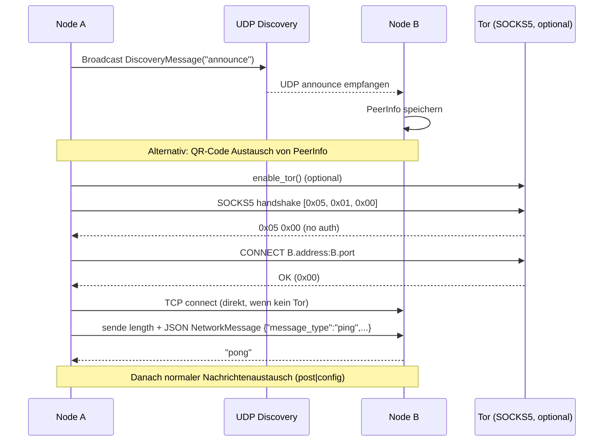
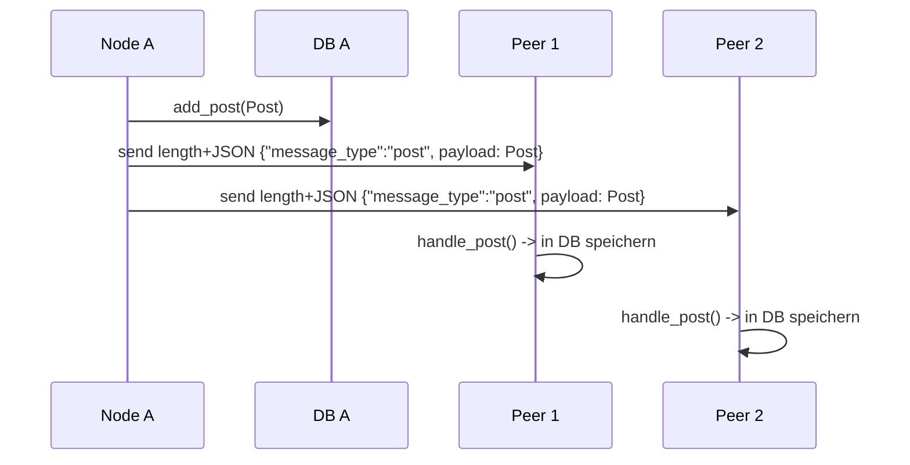

## Brezn Netzwerkarchitektur

### Überblick
- Dezentrale P2P‑Feed‑App ohne zentrale Server
- HTTP/UI‑Layer: Actix‑Web (Port 8080) liefert `web/index.html` und REST‑API (`/api/...`)
- Transport: TCP mit Längenpräfix + JSON (`NetworkMessage`)
- Optionaler Transport über Tor SOCKS5 Proxy
- Peer Discovery: UDP Broadcast und QR‑Code‑Austausch
- Nachrichtentypen: `post`, `config`, `ping`, `pong`
- Persistenz: Lokale SQLite‑Datenbank pro Node

### Komponenten
- `http` (Actix‑Web): UI/REST API für Posts, Config, Netzwerk‑Status
- `discovery` (UDP + QR): Findet Peers und tauscht Basisdaten aus
- `network` (TCP): Nachrichtenübertragung, Broadcast an Peers
- `tor` (SOCKS5): Optionaler anonymer Transportkanal
- `database`: Speichert Posts und Konfiguration lokal

### Handshake- und Verbindungsablauf

### Nachrichtenformat
- Längenpräfix (4 Bytes, Big‑Endian) + JSON serialisierte `NetworkMessage`
- `NetworkMessage` Felder:
  - `message_type: String` (z.B. `post`, `config`, `ping`, `pong`)
  - `payload: serde_json::Value`
  - `timestamp: u64`
  - `node_id: String`

### Verteilung der Posts

### Datenflüsse
- Post erstellen: UI -> `create_post` -> `database.add_post` -> `network.broadcast_post`
- Post empfangen: `network.handle_message` -> `DefaultMessageHandler.handle_post` -> `database.add_post`
- Discovery: `DiscoveryManager.broadcast_presence` -> Peers speichern -> QR optional
- Tor: `TorManager.enable` -> SOCKS5‑Handshake -> `connect_through_tor`

### Sicherheit (IST)
- Lokale Daten: AES‑256‑GCM
- Geplante/optionale E2E: NaCl Box (X25519 + ChaCha20‑Poly1305) vorhanden, in `network` noch nicht angewandt
- Anonymisierung: Tor SOCKS5 (optional)

### Grenzen und nächste Schritte
- Kein Gossip/Relay/Anti‑Duplikation – derzeit Best‑Effort Broadcast
- Kein Nachholmechanismus für verpasste Posts
- Hostname‑Resolution über SOCKS5 (ATYP=0x03) noch offen
- Optionaler initialer Ping/Pong für Liveness kann automatisiert werden
- E2E‑Verschlüsselung der `NetworkMessage` im Transport ergänzen

### Relevante Dateien
- `brezn/src/main.rs` – HTTP/UI (Actix‑Web)
- `brezn/src/discovery.rs` – Peer Discovery (UDP + QR)
- `brezn/src/network.rs` – TCP, Nachrichten, Broadcast
- `brezn/src/tor.rs` – Tor SOCKS5 Anbindung
- `brezn/src/types.rs` – `Post`, `Config`, `NetworkMessage`
- `brezn/src/database.rs` – SQLite Persistenz